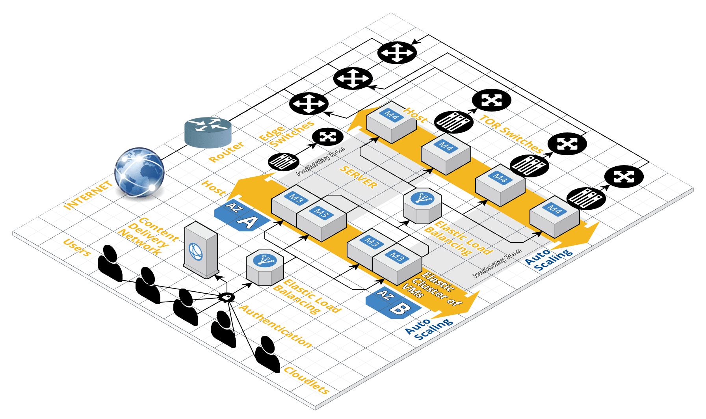

### CS 441 Course Project - Create and evaluate CloudSim Plus simulations that use different load balancing algorithms
### Submission By - Unaiza Faiz, Tanveer Shaikh, Joylyn Lewis 

### How to run the code:
1. Clone the repository to your local machine using 

	``git clone git@bitbucket.org:unaizafaiz/unaiza_faiz_project.git ``

2. Go to the cloned repository location on your terminal and test the program using
``sbt clean compile test``
3. Go to the cloned repository location on your terminal and compile the program using
``sbt clean compile run``
4. When prompted to enter a number to select main class. Enter the number of the desired load balancer class you want to run. 
5. The output prints a table of results for execution of 500 cloudlets. 

**For Building the Docker image:**

**Locally:**
Command to build image: **docker build -f Dockerfile -t docker-cloudsim-plus .**  
Command to run the image: **docker run -it docker-cloudsim-plus**  

The generated Docker image has been pushed to the Docker Hub public repository: **https://cloud.docker.com/repository/docker/unaizafaiz/unaiza_faiz_project**  
Account name: **unaizafaiz**  
Repository name: **unaiza_faiz_project**  
Tag name: **cloudsim-plus**  

#### Steps to run docker image from hub
1. Pull the image using: `docker pull unaizafaiz/unaiza_faiz_project:cloudsim-plus`
2. Run the image using: `docker run -it unaizafaiz/unaiza_faiz_project:cloudsim-plus`

#### Structure of the project folder:
- /src/main/resources folder contains the files:
    - default.conf that contains the configuration settings for running the simulation  
    - PlanetLab trace file - used to test CPU utilization model using trace files
- /src/main/scala/com/cloudsimplus/app:
    - NetworkAbstract.scala contains an abstract class that defines network cloud simulation methods and must be extended to implement different load balancers
    - RandomLoadBalancer.scala contains the implementation of the Random algorithm (extend NetworkVM)
    - RoundRobinLoadBalancer.scala contains the implementation of the Round Robin algorithm  (extends NetworkVM)
    - HorizontalVmScalingLB.scala contains the implementation of the Horizontal VM Scaling algorithm  
- /src/main/java
    - org.cloudbus.cloudsim.utilzationmodels/UtilizationModelHalf.java creates a CPU utilization model that uses 50% of the CPU resources at a time
    - org.cloudsimplus.builders.tables/CloudletsTableBuilderWithCost.java extend the cloudsimplus CloudletsTableBuilder to print the results with total cost for each cloudlet

#### Approach towards designing the simulation:
The goal of this course project is to simulate cloud environments in CloudSim Plus using different load balancers in a networked cloud architecture. The evaluation of the load balancers is based on the time and cost of processing the cloudlets which are submitted dynamically in the simulation. 

We use three different load balancers in our simulation:
- Random: Random is a static algorithm that uses a random number generator to assign cloudlets to VMs. We use the Random algorithm as the baseline for evaluating the simulation.
- Round Robin: Round robin is another static load balancing algorithm where each cloudlet will be assigned to VM in a round - robin sequence.
- Horizontal VM Scaling: Horizontal VM Scaling is a dynamic load balancing algorithm that allows defining the condition to identify an overloaded VM, which in our case is based on current CPU utilization exceeding 70%, which will result in the creation of additional VMs.

As part of our evaluation, we assume the below Null and Alternate Hypotheses:

**Null Hypothesis:** Horizontal VM Scaling algorithm performs better than the Random and Round Robin algorithms  
**Alternate Hypothesis:** No improvement in performance can be seen with Horizontal VM Scaling algorithm as compared with the Random and Round Robin algorithms  

**Architecture of the Cloud Network**

(The file 'CloudSimPlusArchitecture' contains the diagram of the cloud network architecture.)

The above figure shows the high-level system architecture of our cloud network. The cloudlets arriving at the endpoint are distributed using load balancers. The load balancers are being simulated using Random, Round-Robin or Horizontal VM Scaling algorithms. Depending on the algorithm, the cloudlets are then assigned to the VMs. In case of horizontal VM scaling, there is auto-scaling of VMs at runtime depending on the current CPU utilization exceeding 70%. Each host is connected to the Edge Switches through a TOR (Top of Row) switch, which is in turn connected to a Router giving our datacenter access to world wide web.

The simulations are carried out on the Cloud Network Architecture with following characteristics:  
- Number of Datacenters:  1
- Number of VMs:  750
- Number of Hosts:  1000
- Number of Cloudlets:  500

**Allocation Policies**
- VM Allocation Policy - VMs are allocated to Hosts using VMAllocationPolicySimple provided by Cloudsim Plus
- VM Scheduling Policy - VMs are scheduled to run using VmSchedulerTimeShared provided by Cloudsim Plus
- Cloudlet Scheduling Policy - Cloudlets are scheduled to run on VMs using CloudletSchedulerSpaceShared provided by Cloudsim Plus
	- We also tested our simulation with CloudletSchedulerTimeShared but random algorithm was taking a longer time to terminate. Hence, we concluded that Space Shared was a better choice
- CPU Utilization Model - Cloudlets use UtilizationModelFull where they always utilize an allocated resources from its Vm at 100% all the time
	- We experimented with our other CPU utilization models using planetlab trace files. Interestingly, using this model, Random Load Balancer performed better than the other 2 Load Balancers. The results were not very impressive after using planetlab tracefiles. One reason for this we thought would be that our tracefiles always had >= 100% utilization of CPU and hence, couldn't perform well. However, it could simulate real-world scenario where there are native processes and programs running on VMs too.
	- We also built our own CPU Utilization model that utilizes 50% of the allocated resources all the time. We found that this incurred a higher cost when compared to other utilization models across all the load balancers

**Evalution of the simulation:**
We did not apply regression analysis as the prediction of cost as well as execution time based on some cloudlet's unseen cloudlet length and/or VM/Host characteristics would be redundant as that is what Cloudsim Plus is built for.

Consecutively, we evaluated our load balancers by keeping cloudlet execution time and cost of running of our total workload as our primary criterion

The results of the simulation are in the file [results.xlsx](./results.xlsx). We found a larger difference in the T-test value between Random vs Horizontal VM scaling and Round Robin vs Horizontal VM Scaling by running T-tests on the corresponding costs of the load balancers. This result is statistically significant as it proves the fact that Round Robin LB algorithm and Horizontal VM Scaling algorithm performs better than just randomly assigning these cloudlets to VMs in different datacenters.
  
We found that the p-value for Horizontal VM Scaling to be 0, when compared to RoundRobin and random load balancers. 
This shows statistical significance.

**Results using the three alogrithms:**  
Random algorithm took higher time to execute when compared to other two algorithm. It took >3000 seconds to complete executing 500 cloudlets
Random LB algorithm took higher time to execute when compared to Round Robin and Horizontal VM Scaling LB algorithms. It took > 3000 seconds to complete executing 500 cloudlets. Random LB and random cloudlet assignment is inefficient and takes a long time.

**Pros and Cons of our approach:**
**Pros:**  
- We apply the theoretical concepts learnt as part of CS 441 course in designing the network architecture and in developing our Null Hypothesis  
- Our statistical results help in proving the hypothesis

**Cons:**  
- The network architecture assumed here is comparatively nascent when considered from the point of view of a real world cloud computing environment. However, we limited our scaling to a basic level due to the challenges enlisted below.

**Challenges faced**
- We attempted scaling our basic architecture to assume higher number of Datacenters, VMs, Hosts along with higher number of dynamic cloudlets. While we were able to achieve scaling with the simple Cloudlet tasks designed 
for Clousim Plus, we faced dynamic VM allocation exceptions due to transfer of packets between the tasks designed for Network Cloudlets. As using Network Cloudlets was a pre-requisite for the project, we performed our simulation on a
limited scale network cloud environment.

**Conclusion:**  
Based on our performance evaluation, we see an improvement in performance in terms of cost and processing time when a dynamic algorithm like Horizontal VM Scaling is used vs other simple static algorithms like Random and Round Robin.
